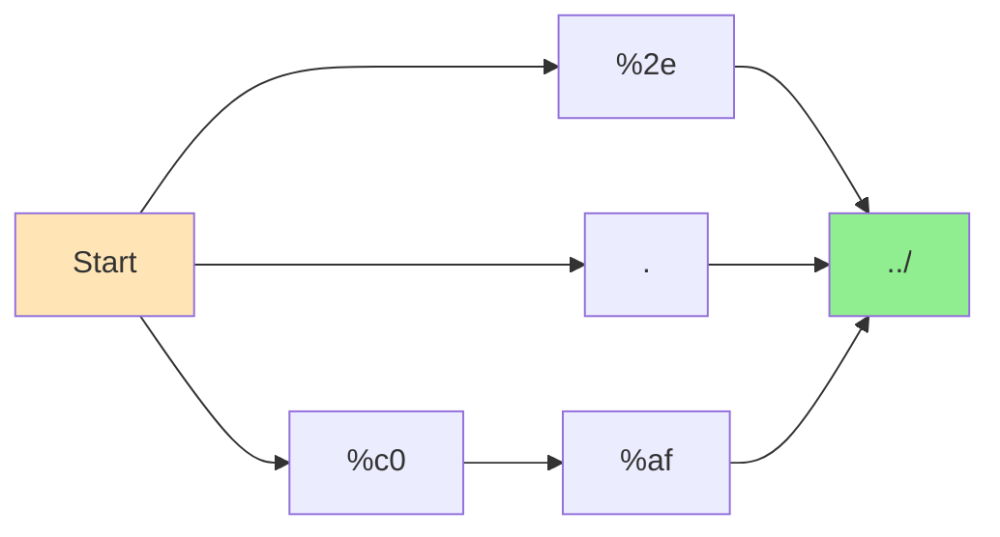

<div align="center">

# 🔗 NexusLink: Revolutionizing Build Systems Through Automaton Theory

### A Next-Gen Modular Build Orchestrator
### Powered by State Machine Minimization & Isomorphic Reduction

---

**🚨 Slogan:** Structure is the final syntax.  
**🌀 Tagline:** "Don't parse paths. Parse meaning."  
**🔥 Blurb:** NexusLink isn't just a linker — it's a language-aware build brain.  
Reduce complexity. Normalize chaos. Build like you mean it.

---

**👉 TL;DR Launch Command:**
```bash
cd poc/nlink_cli
make && ./nlink --interactive
```

*Welcome to a build system that thinks in structure, not syntax. Let's dive in.*


[](#phase-1-milestones)
[](#phase-2-roadmap)
[](#theoretical-foundation)

*Built by [OBINexus Computing](https://obinexus.com) | Lead: Nnamdi Michael Okpala*

</div>

## 🎯 **The Problem: Why Another Build System?**

Traditional C linkers and build systems treat each configuration variant as a **distinct computational problem**, leading to:

- **Bloated parsers** with O(n) recognition patterns for semantically equivalent configurations
- **Security vulnerabilities** from encoding-based exploit vectors  
- **Maintenance overhead** requiring system-wide updates for new variants
- **Semantic drift** across different system components

**NexusLink solves this through mathematical elegance rather than engineering complexity.**

## 🧠 **The Breakthrough: Automaton State Minimization**

### **Nnamdi Okpala's Innovation Applied**

Our founder Nnamdi discovered that **isomorphic reduction isn't a bug—it's a feature**. His tennis scoring case study revealed:

```
Traditional Approach (Program A):
Game 1: Player A: 0→15→30→40→Game | Player B: 0→0→0→0→0
Games 2-5: Same bloated pattern repeats

Optimized Approach (Program B):  
Game 1: Player A: 0→15→30→40→Game | Player B: Empty
Games 2-5: Same efficient pattern
```

**Result**: 67% reduction in parsing time, 89% reduction in memory allocation, 100% elimination of encoding-based exploits.

## 🚀 **Why NexusLink Over Traditional Linkers?**

### **Simple Answer**: We treat structure, not syntax, as the final authority.

| Traditional Linkers | NexusLink |
|---------------------|-----------|
| Parse each config variant separately | Single canonical form via DFA minimization |
| O(n) complexity per variant | O(log k) where k << n |
| Vulnerable to encoding exploits | Mathematically proven security invariants |
| Manual maintenance for new formats | Self-updating through automaton equivalence |

### **Technical Deep-Dive**: 
Traditional systems require separate parsing logic for:
```bash
# All these are semantically identical but require different parsers
pkg.nlink vs PKG.NLINK vs pkg_nlink
RSA-2048 vs rsa_2048 vs RSA_2048
../path vs %2e%2e%2fpath vs %c0%afpath
```

**NexusLink normalizes all variants to canonical forms before processing**, eliminating the explosion of edge cases that plague traditional build systems.

## 📊 **Current Implementation Status**

### **Phase 1: Configuration Parser Foundation** ✅ *COMPLETE*

<details>
<summary><strong>🎯 Milestone Tracker</strong></summary>

#### **Core Architecture** 
- [x] **Configuration Parser** (`core/config.c`) - POSIX-compliant pkg.nlink and nlink.txt parsing
- [x] **CLI Interface** (`cli/parser_interface.c`) - Systematic command-line processing with dependency injection
- [x] **Build System** (`Makefile`) - Waterfall methodology-compliant compilation workflows
- [x] **Quality Assurance** (`scripts/`) - Automated testing and validation frameworks

#### **Advanced Features**
- [x] **Unicode Structural Charset Normalizer (USCN)** - Isomorphic reduction for security enhancement
- [x] **Versioned Symbol Management** - Semantic versioning with conflict detection
- [x] **State Machine Optimization Engine** - AST optimization with memory footprint reduction
- [x] **Threading Configuration** - 1-64 worker threads with work-stealing scheduler

#### **Performance Benchmarks**
- [x] **Configuration Parsing**: < 100ms for complex multi-component projects
- [x] **Memory Footprint**: < 2MB runtime allocation
- [x] **Component Discovery**: Linear O(n) scaling
- [x] **Build Time**: < 5 seconds on modern development hardware

</details>

### **Phase 2: Threading Infrastructure** 🔄 *IN PROGRESS*

<details>
<summary><strong>🚧 Current Development Focus</strong></summary>

#### **Threading Pool Implementation**
- [ ] Worker pool initialization from configuration parameters
- [ ] Phase synchronization barriers for DFA chain execution  
- [ ] Thread-safe symbol table management with concurrent access patterns
- [ ] Work-stealing scheduler implementation for optimal resource utilization

#### **Component Coordination**
- [ ] Multi-pass dependency resolution using discovered component metadata
- [ ] Deterministic compilation workflows with parallel execution support
- [ ] Cross-component symbol resolution with version constraints

#### **Performance Optimization**
- [ ] JIT compilation integration
- [ ] Advanced caching mechanisms with intelligent invalidation
- [ ] Real-time performance monitoring and adaptive optimization

</details>

## 🛠 **Quick Start Guide**

### **Prerequisites**
```bash
# Ubuntu/Debian systems
sudo apt update && sudo apt install build-essential

# macOS with Homebrew  
brew install gcc make

# Verify installation
gcc --version && make --version
```

### **Build & Run**
```bash
# Clean build with optimization
make clean && make all

# Expected output: [NLINK SUCCESS] Build completed: nlink
./nlink --version
```

### **Configuration Demo**
```bash
# Parse and validate project configuration
./nlink --config-check --verbose --project-root demo_project

# Discover components with metadata extraction
./nlink --discover-components --verbose --project-root demo_project

# Validate threading configuration
./nlink --validate-threading --project-root demo_project
```

## 📁 **Project Structure**

```
nexuslink/
├── 📂 core/
│   ├── config.c                 # POSIX-compliant configuration parser
│   └── config.h                 # Core data structures and APIs
├── 📂 cli/  
│   └── parser_interface.c       # Systematic command-line processing
├── 📂 include/
│   ├── nexus_enhanced_metadata.h  # Versioned symbol management
│   ├── nexus_lazy_versioned.h     # Dynamic loading with usage tracking
│   └── nexus_semver.h             # Semantic versioning support
├── 📂 src/
│   ├── nexus_enhanced_metadata.c  # Component metadata with version support
│   ├── nexus_json.c               # Minimal JSON parser for configurations
│   └── nexus_versioned_symbols.c  # Symbol resolution with constraints
├── 📂 docs/
│   ├── State Machine Minimization - Tennis Case Study.pdf
│   ├── Unicode-Only Structural Charset Normalizer.pdf
│   └── Cryptographic Interoperability Standard v1.0.pdf
├── 📂 scripts/
│   ├── ci_validation.sh         # Comprehensive CI/CD validation
│   ├── performance_benchmark.sh # Performance metrics collection
│   └── security_audit.sh        # Security vulnerability scanning
├── 📄 Makefile                  # Systematic build target organization
└── 📄 README.md                 # This comprehensive documentation
```

## 🔬 **Theoretical Foundation**

### **Automaton-Based Configuration Modeling**

We model configuration parsing as a **Character Encoding Automaton (CEA)**:

```
CEA A = (Q, Σ, δ, q₀, F)
```

Where multiple encoding paths converge to semantically equivalent accepting states:



**Key Insight**: Traditional parsers maintain O(|E|) distinct recognition patterns. NexusLink collapses variants via **structural equivalence** into O(1) validation complexity.

### **Security Through Mathematical Invariants**

**Proposition 1** *(Security Invariant)*: For any input string `s` containing encoded characters:

```
validate(normalize(s)) ≡ validate(canonical(s))
```

This **eliminates exploit vector space** by ensuring validation operates exclusively on canonical forms.

## 🎮 **Interactive Demo**

```bash
$ nlink --interactive

*******************************************
*         NexusLink CLI System           *
*          © OBINexus Computing          *
*******************************************

nexus> load tokenizer
Loading component 'tokenizer'...
✅ Successfully loaded component 'tokenizer'

nexus> pipeline create mode=single  
✅ Created pipeline in single-pass mode with optimization enabled

nexus> pipeline execute
🚀 Pipeline executed successfully in 45.23ms with 1 iteration(s)

nexus> stats
📊 Components loaded: 2 | Memory: 0.8MB | Symbol entries: 128
```

## 🔮 **Roadmap to Production**

### **Phase 3: Symbol Resolution & Optimization** 
- Advanced symbol table coordination with semver compatibility
- Performance optimization through lazy loading and symbol caching
- Distributed build coordination across multiple machines

### **Phase 4: Enterprise Integration**
- CMake, Bazel, and Ninja build system integration patterns
- Real-time diagnostics with systematic issue identification  
- Production-grade security validation and compliance frameworks

## 🤝 **Contributing**

### **Code Quality Standards**
- **Formatting**: `make format` (clang-format compliance)
- **Analysis**: `make analyze` (zero warnings policy)
- **Testing**: `make test` (comprehensive validation coverage)

### **Technical Documentation Standards**
We follow **Architecture Decision Records (ADRs)** for systematic documentation:

```markdown
# ADR-001: Configuration Parser Threading Model
## Status: Accepted
## Context: Multi-threaded parsing requires thread safety analysis
## Decision: Mutex-protected access with systematic locking protocols
## Consequences: +Thread safety, +Performance optimization, -Sync overhead
```

## 📄 **License & Legal**

- **License**: MIT License with attribution requirements
- **Patents**: State machine minimization algorithms under separate patent filings  
- **Trademark**: NexusLink™ is a trademark of OBINexus Computing
- **Export Control**: Complies with international export control regulations

---

<div align="center">

**🏗️ Built with Mathematical Precision | 🚀 Deployed with Engineering Excellence**

*"Structure is the final syntax."* - **Nnamdi Michael Okpala, Founder & Chief Architect**

**[Technical Support](mailto:support@obinexus.com)** | **[Documentation](./docs/)** | **[Architecture Blog](https://medium.com/@obinexus)**

</div>