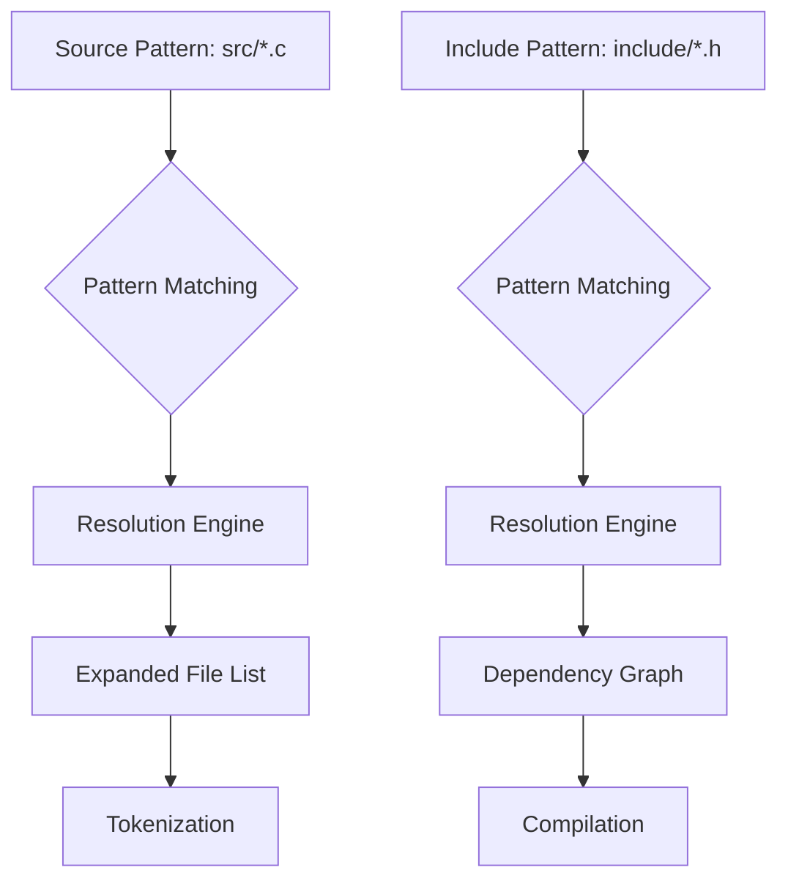

# NexusLink Component Build System: Declarative Compilation Framework

## I. Structural Architecture

### A. Compilation Specification Model

The NexusLink scripting system implements a declarative approach to component compilation through a structured manifest system. This architecture enables cross-format output generation through semantic resolution rather than imperative logic.

| Element Category | Specification Pattern | Transformation Purpose |
|------------------|----------------------|------------------------|
| **Source Resolution** | `source "src/*.c" -> transform(capture)` | Wildcard pattern-matching for source inclusion |
| **Include Binding** | `include "include/*.h" -> bind(source)` | Dependency linkage between sources and headers |
| **Module Registration** | `register module(name="tokenizer", version="1.0.0")` | Component identity declaration for system registry |
| **Output Target** | `target ".{a,so,exe}" -> resolve(platform)` | Multi-format compilation targeting |

### B. Flow-Based Processing Model

The NexusLink compilation pipeline employs a declarative flow description rather than imperative state logic:

```
input -> tokenize -> parse -> transform -> optimize -> generate -> output
```

This flow-based approach enables the system to:
1. Maintain separation between transformation specification and implementation
2. Apply functional operations (map, filter, reduce) without state manipulation
3. Enable declarative error handling through result propagation

## II. Declarative Script Framework

### A. Component Manifest Structure

```
// tokenizer.nlink - NexusLink component manifest
// Declarative compilation specification

// Component identity and versioning
component "tokenizer" {
    version: "1.0.0",
    description: "Token analysis system",
    author: "NexusLink System"
}

// Source resolution (wildcard patterns)
sources {
    include: [
        "src/*.c",          // All C source files
        "!src/*_test.c"     // Exclude test files
    ],
    headers: [
        "include/*.h"       // All header files
    ]
}

// Dependency resolution
dependencies {
    require: [
        "core >= 1.0.0",    // Semantic version constraints
        "pattern"           // Latest version implied
    ]
}

// Build configuration
build {
    // Multi-target output specification
    targets: [
        {type: "static", extension: ".a"},      // Static library
        {type: "shared", extension: ".so"},     // Shared library
        {type: "executable", extension: ".exe"} // Executable
    ],
    
    // Transformation pipeline
    pipeline: [
        {stage: "preprocess", options: {macros: ["DEBUG=1"]}},
        {stage: "compile", options: {optimize: true, warnings: "all"}},
        {stage: "link", options: {strip: false}}
    ],
    
    // Functional transformations
    transforms: [
        // Apply map operation to process all sources
        map("src/*.c", (file) => {
            // Track dependencies dynamically
            analyze_dependencies(file);
            return process_file(file);
        }),
        
        // Filter operation for selective processing
        filter("*.o", (obj) => {
            return passes_verification(obj);
        })
    ]
}

// Error handling specification
errors {
    on_failure: "propagate",       // Error propagation strategy
    output: "stderr",              // Error output destination
    format: "nexus_error_format"   // Error formatting protocol
}
```

### B. Flow Control Specification

The compilation flow is declared rather than imperatively programmed:

```
// Single-pass compilation flow
flow single_pass {
    input("src/*.c")
        -> tokenize(options={preserve_comments: true})
        -> parse(options={construct_ast: true})
        -> transform([
            optimize_constants(),
            eliminate_dead_code(),
            inline_small_functions()
        ])
        -> generate(target="executable")
        -> output("tokenizer.exe");
}

// Multi-pass compilation flow
flow multi_pass {
    // First pass: Analysis and optimization
    pass analysis {
        input("src/*.c")
            -> analyze()
            -> optimize()
            -> output("intermediate");
    }
    
    // Second pass: Code generation
    pass generation {
        input("intermediate")
            -> generate_code()
            -> output("tokenizer");
    }
}
```

## III. Component Resolution System

### A. Wildcard Path Resolution

The system implements pattern-based resolution using structured wildcards:



### B. Module Dependencies

```
// Dependency resolution specification
dependencies {
    // Direct dependencies with version constraints
    direct: [
        {name: "core", version: ">=1.0.0"},
        {name: "pattern", version: "^2.0.0"}
    ],
    
    // Transitive dependency resolution strategy
    resolution: {
        strategy: "semantic",
        conflict_resolution: "newest_compatible"
    },
    
    // Dynamic module loading
    loading: {
        mode: "lazy",
        paths: ["${NLINK_MODULE_PATH}", "./modules"]
    }
}
```

## IV. Transformation Operations

### A. Functional Processing Primitives

```
// Transformation operations
transforms {
    // Map operation: Apply transformation to each item
    map: (items, transform_fn) => {
        return items.map(transform_fn);
    },
    
    // Filter operation: Select items based on predicate
    filter: (items, predicate) => {
        return items.filter(predicate);
    },
    
    // Reduce operation: Combine items into single result
    reduce: (items, reducer, initial) => {
        return items.reduce(reducer, initial);
    },
    
    // Compose operation: Chain transformations
    compose: (...transforms) => {
        return (input) => {
            return transforms.reduce((acc, fn) => fn(acc), input);
        };
    }
}
```

### B. AST Transformation Framework

```
// AST transformation specification
ast_transforms {
    // Tree traversal strategy
    traversal: {
        order: "post-order",
        visit: (node) => transform_node(node)
    },
    
    // Node transformations
    transformations: [
        {
            pattern: "BinaryExpression[operator='*']",
            transform: (node) => optimize_multiplication(node)
        },
        {
            pattern: "IfStatement[condition.type='BooleanLiteral']",
            transform: (node) => fold_constant_condition(node)
        }
    ]
}
```

## V. Error Handling Protocol

### A. Error Propagation Model

```
// Error handling specification
error_handling {
    // Result-based error propagation
    propagation: {
        strategy: "result_monad",
        chain_mode: "short_circuit"
    },
    
    // Error categorization
    categories: {
        parse: {severity: "critical", recoverable: false},
        type: {severity: "error", recoverable: true},
        optimization: {severity: "warning", recoverable: true}
    },
    
    // Error output formatting
    output: {
        destination: "stderr",
        format: "nexus_error_format",
        verbosity: "detailed"
    }
}
```

### B. NexusResult Protocol

```
// NexusResult protocol specification
protocol NexusResult {
    // Success state with value
    Success(value) => {
        is_success: true,
        value: value,
        error: null
    },
    
    // Error state with details
    Error(code, message, details) => {
        is_success: false,
        value: null,
        error: {
            code: code,
            message: message,
            details: details,
            location: get_error_location()
        }
    }
}
```

## VI. Implementation Framework

### A. Command-Line Interface

```
# Compile tokenizer.nlink to different targets
nlink build tokenizer.nlink --target static    # Creates tokenizer.a
nlink build tokenizer.nlink --target shared    # Creates tokenizer.so
nlink build tokenizer.nlink --target exe       # Creates tokenizer.exe

# Multi-target compilation
nlink build tokenizer.nlink --target all       # Creates all target types

# Custom configuration
nlink build tokenizer.nlink --config release.config
```

### B. Integration with NexusLink Component System

```mermaid
flowchart TB
    A[tokenizer.nlink] --> B{NexusLink Build System}
    B --> C[Pattern Resolution]
    C --> D[Dependency Analysis]
    D --> E[Multi-Pass Pipeline]
    E --> F1[Static Library (.a)]
    E --> F2[Shared Library (.so)]
    E --> F3[Executable (.exe)]
    
    G[Component Registry] -.-> B
    H[Transformation System] -.-> E
```

## VII. Extensibility Framework

### A. Custom Transformation Registration

```
// Plugin registration for custom transformations
register_transformation("custom_optimization", {
    pattern: "CustomNode",
    priority: 5,
    transform: (node) => {
        // Custom transformation logic
        return transformed_node;
    }
});
```

### B. Pipeline Extension Model

```
// Pipeline extension
extend_pipeline("compilation", {
    before: "generate",
    stage: {
        name: "custom_analysis",
        processor: custom_analyzer,
        options: {
            detailed: true,
            metrics: ["complexity", "performance"]
        }
    }
});
```

## VIII. Conclusion: Architectural Principles

The NexusLink component build system implements a declarative approach to compilation through:

1. **Pattern-Based Resolution** - Using wildcard paths to identify and process components
2. **Functional Transformation** - Applying map, filter, and reduce operations without state manipulation
3. **Declarative Flow Description** - Specifying component flow for single-pass and multi-pass compilation
4. **Result-Based Error Handling** - Propagating errors through a structured NexusResult protocol
5. **Multi-Target Output Generation** - Producing various binary formats (.a, .so, .exe) from a single manifest

This architecture enables robust component development with clean separation between transformation specification and implementation logic, while maintaining compatibility with the broader NexusLink ecosystem.