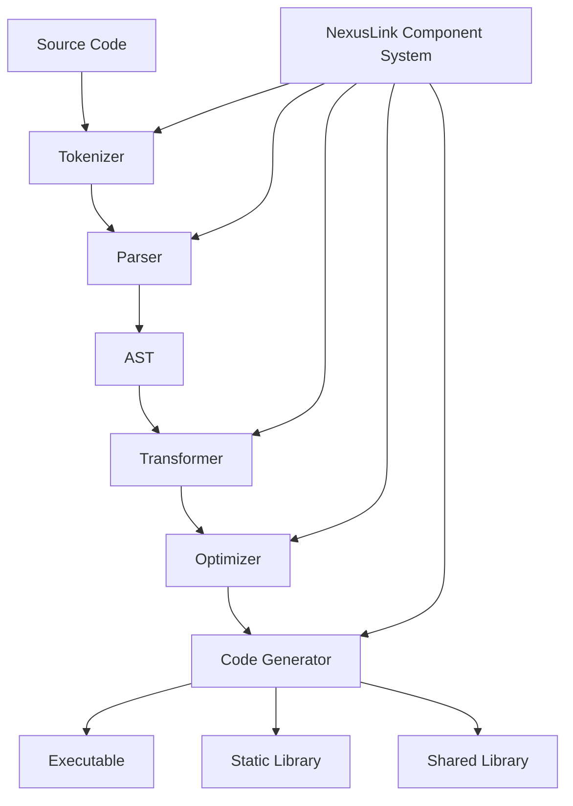

# NexusLink Scripting System: Architecture & Implementation Framework

## Systematic Framework Overview

The NexusLink Scripting System represents a comprehensive compilation and transformation architecture designed to facilitate modular component development within the NexusLink ecosystem. This document provides a structured analysis of the system's architecture, processing pipeline, and implementation methodology.

## 1. Architectural Components

### 1.1 Core Processing Units

| Component | Primary Function | Integration Points |
|-----------|------------------|-------------------|
| **Tokenizer** | Lexical decomposition of source input | Input: Source code<br>Output: Token stream |
| **Parser** | Syntactic analysis and AST construction | Input: Token stream<br>Output: Abstract Syntax Tree |
| **Transformer** | AST manipulation and optimization | Input: AST<br>Output: Transformed AST |
| **Code Generator** | Target code production | Input: Transformed AST<br>Output: Executable artifacts |

### 1.2 Type System Integration

The token system implements a hierarchical type framework:

```
nlink_token_base
├── nlink_token_identifier (variables, symbols)
├── nlink_token_literal (constants, values)
├── nlink_token_operator (arithmetic, logical operations)
├── nlink_token_keyword (language keywords)
├── nlink_token_expression (computational expressions)
├── nlink_token_statement (code statements)
└── nlink_token_program (complete executable unit)
```

### 1.3 Regular Expression Pattern Matching

Pattern matching employs a systematic approach for token identification:

| Pattern Type | Implementation | Usage Context |
|--------------|----------------|---------------|
| **Literal Patterns** | Direct string comparison | Keywords, operators |
| **Character Class Patterns** | Predefined character sets | Identifiers, numbers |
| **Quantifier Patterns** | Repetition specifications | String literals, comments |
| **Alternation Patterns** | Multiple pattern options | Complex tokens |

## 2. Processing Pipeline Architecture

### 2.1 Pipeline Stages

The NexusLink processing pipeline implements a tactical transformation approach:

1. **Source Input Processing**
   - File loading and preprocessing
   - Directive resolution
   - Character encoding normalization

2. **Lexical Analysis**
   - Token generation based on pattern matching
   - Token categorization and classification
   - Source mapping for error reporting

3. **Syntactic Analysis**
   - Grammar-based parsing
   - AST construction with node hierarchy
   - Syntax validation and error detection

4. **Semantic Analysis**
   - Type checking and inference
   - Symbol resolution and linking
   - Semantic validation

5. **Transformation**
   - AST manipulation and optimization
   - Dead code elimination
   - Constant folding and propagation

6. **Code Generation**
   - Target-specific code emission
   - Symbol table generation
   - Executable artifact production

### 2.2 Integration with Component System



## 3. Implementation Methodology

### 3.1 Tactical Programming Application

The NexusLink scripting system leverages tactical programming patterns for transformation operations:

| Tactic | Implementation | Application |
|--------|----------------|-------------|
| **Composition** | `nlink_compose()` | Combining transformations |
| **Abstraction** | `nlink_map()`, `nlink_filter()` | Generic operations |
| **Aggregation** | `nlink_aggregate()` | Collective processing |
| **Transformation** | `nlink_transform()` | Data structure modification |
| **Traversal** | `nlink_traverse_tree()` | AST navigation |
| **Identity** | `nlink_identity()` | Baseline operations |

### 3.2 Script Processing Workflow

```
                    ┌─────────────┐
                    │  Script     │
                    │  Source     │
                    └──────┬──────┘
                           │
                           ▼
┌─────────────┐     ┌─────────────┐     ┌─────────────┐
│  Token      │     │  Abstract   │     │  Target     │
│  Stream     │◄────┤  Syntax     │◄────┤  Code       │
│             │     │  Tree       │     │             │
└──────┬──────┘     └──────┬──────┘     └──────┬──────┘
       │                   │                   │
       ▼                   ▼                   ▼
┌─────────────┐     ┌─────────────┐     ┌─────────────┐
│  Lexical    │     │  Semantic   │     │  Output     │
│  Analysis   │     │  Analysis   │     │  Generation │
└─────────────┘     └─────────────┘     └─────────────┘
```

### 3.3 Command-line Interface Integration

| Command | Function | Implementation |
|---------|----------|----------------|
| `nlink run <script.nlink>` | Execute script | `handle_run_command()` |
| `nlink compile <script.nlink> <output>` | Compile to target | `handle_compile_command()` |
| `nlink --optimize` | Enable optimizations | `config.enable_optimizations = true` |
| `nlink --strict` | Enable strict mode | `config.strict_mode = true` |

## 4. Target Output Generation

### 4.1 Compilation Targets

The system supports multiple compilation target formats:

| Target Type | Implementation | Output Format |
|-------------|----------------|---------------|
| **Executable** | `NLINK_COMPILE_EXECUTABLE` | Platform-specific executable |
| **Static Library** | `NLINK_COMPILE_STATIC_LIB` | `.a` archive file |
| **Dynamic Library** | `NLINK_COMPILE_DYNAMIC_LIB` | `.so` or `.dll` file |
| **Object File** | `NLINK_COMPILE_OBJECT` | `.o` or `.obj` file |

### 4.2 Optimization Strategies

| Optimization | Implementation | Effect |
|--------------|----------------|--------|
| **Constant Folding** | Compile-time evaluation | Reduced runtime calculations |
| **Dead Code Elimination** | Unreachable code removal | Reduced binary size |
| **Expression Simplification** | Mathematical reductions | Improved performance |
| **Inline Expansion** | Function inlining | Reduced call overhead |

## 5. Integration Examples

### 5.1 Basic Script Processing

```c
// Initialize script processor
nlink_script_processor_init(NULL);

// Load script
char* source = nlink_script_load("example.nlink");

// Process script
nlink_script_result* result = nlink_script_process(source, "example.nlink", NULL);

// Handle result
printf("Exit code: %d\n", result->exit_code);
printf("Output: %s\n", result->stdout_output);

// Clean up
nlink_script_result_free(result);
free(source);
nlink_script_processor_shutdown();
```

### 5.2 Compilation to Target Format

```c
// Initialize script processor
nlink_script_config config = {
    .enable_optimizations = true,
    .strict_mode = false,
    .debug_symbols = true
};
nlink_script_processor_init(&config);

// Load script
char* source = nlink_script_load("component.nlink");

// Compile to shared library
bool success = nlink_script_compile(
    source,
    "component.nlink",
    "libcomponent.so",
    NLINK_COMPILE_DYNAMIC_LIB,
    &config
);

// Clean up
free(source);
nlink_script_processor_shutdown();
```

## 6. Script Language Syntax Structure

### 6.1 Statement Types

| Statement Type | Token Representation | Example Syntax |
|----------------|----------------------|----------------|
| **Declaration** | `NLINK_STMT_DECLARATION` | `var x = 42;` |
| **Assignment** | `NLINK_STMT_ASSIGNMENT` | `x = y + 1;` |
| **Conditional** | `NLINK_STMT_CONDITIONAL` | `if (x > 0) { ... }` |
| **Loop** | `NLINK_STMT_LOOP` | `while (x > 0) { ... }` |
| **Pipeline** | `NLINK_STMT_PIPELINE` | `pipeline name { stages... }` |

### 6.2 Expression Types

| Expression Type | Token Representation | Example Syntax |
|-----------------|----------------------|----------------|
| **Literal** | `NLINK_EXPR_LITERAL` | `42`, `"text"`, `true` |
| **Identifier** | `NLINK_EXPR_IDENTIFIER` | `variable_name` |
| **Binary** | `NLINK_EXPR_BINARY` | `a + b`, `x == y` |
| **Call** | `NLINK_EXPR_CALL` | `function(arg1, arg2)` |
| **Lambda** | `NLINK_EXPR_LAMBDA` | `(x, y) => expression` |

## 7. Implementation Path Forward

### 7.1 Development Phases

1. **Foundation Implementation**
   - Core token system development
   - Type system integration
   - Basic parsing capabilities

2. **Pipeline Expansion**
   - Transformation components
   - Optimization strategies
   - Code generation frameworks

3. **Target Support Extension**
   - Platform-specific executable generation
   - Cross-platform library compilation
   - Integration with existing build systems

4. **Optimization and Enhancement**
   - Performance optimization
   - Advanced language features
   - Developer tooling integration

### 7.2 Implementation Priorities

| Priority | Component | Rationale |
|----------|-----------|-----------|
| 1 | Token System | Foundation for all operations |
| 2 | Parser Implementation | Required for AST generation |
| 3 | Code Generation | Enables practical output |
| 4 | Optimization Framework | Enhances output quality |
| 5 | Language Extensions | Expands functionality |

## 8. Conclusion

The NexusLink Scripting System provides a comprehensive framework for source code processing, transformation, and compilation. By leveraging tactical programming patterns and a modular architecture, it offers flexibility and extensibility while maintaining structural integrity and processing efficiency.

The integration with the broader NexusLink component system enables seamless incorporation into existing workflows and development processes, furthering the system's utility and applicability across diverse development scenarios.